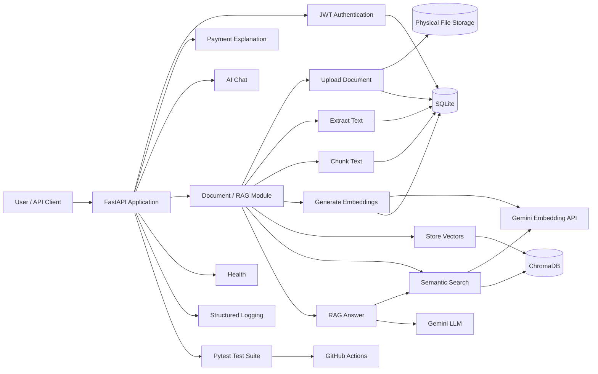

# AI Payment Assistant

<p align="center">
  <strong>AI-powered assistant for understanding SWIFT MT messages, ISO 20022 messages, payment workflows, and payment-domain documentation using Retrieval-Augmented Generation (RAG).</strong>
</p>

<p align="center">
  
  
  
  
  
  
  
</p>

---

## Overview

AI Payment Assistant is a FastAPI-based backend application designed to make complex international-payment concepts and payment documentation easier to understand.

Version 3 adds a complete document intelligence and RAG pipeline on top of the Version 2 authentication, payment explanation, AI chat, logging, testing, and CI capabilities.

The application can:

- Explain SWIFT MT and ISO 20022 payment messages
- Answer payment-domain questions using Google Gemini
- Register and authenticate users with JWT
- Upload and manage payment-related PDF/TXT/DOCX documents
- Extract text from uploaded documents
- Split extracted text into overlapping chunks
- Generate vector embeddings for document chunks
- Store and index embeddings in ChromaDB
- Perform semantic search against a user-owned document
- Generate grounded answers from retrieved document context
- Return source chunk references with RAG answers
- Delete a document together with its physical file, SQLite metadata, chunks, and Chroma vectors
- Provide application and AI-service health checks
- Run automated tests through GitHub Actions

This project combines backend engineering, Generative AI, Retrieval-Augmented Generation, vector search, and international-payments domain knowledge.

---

## Version 3 Highlights

### Secure Document Ingestion

- Authenticated document upload
- User-level document ownership
- File type and size validation
- Physical file storage
- SQLite document metadata
- Safe deletion across file storage, SQLite, and ChromaDB

### Document Processing

- PDF/TXT text extraction
- Processing status tracking
- Character and page-count metadata
- Configurable chunk size and overlap
- Ordered document chunks stored in SQLite

### Embeddings

- Google Gemini embedding generation
- Configurable embedding dimension
- Embedding model/status tracking
- Temporary embedding persistence in SQLite during the learning-oriented V3 pipeline

### Vector Storage

- Persistent ChromaDB storage
- Deterministic vector IDs
- Chunk text stored alongside vectors
- Metadata filters for `document_id` and `user_id`
- Idempotent vector upsert

### Semantic Search

- Query embedding generation
- Chroma nearest-neighbor search
- Top-K retrieval
- Document/user metadata filtering
- Distance and relevance information

### Retrieval-Augmented Generation

- Question + retrieved chunks → grounded Gemini prompt
- Answers constrained to retrieved document context
- Source chunk references returned with the answer
- Insufficient-context handling
- Support for direct, list, comparison, and multi-part questions

---

## Technology Stack

| Area | Technology |
|---|---|
| Programming language | Python |
| API framework | FastAPI |
| AI provider | Google Gemini |
| Embedding provider | Google Gemini Embeddings |
| Vector database | ChromaDB |
| ORM | SQLAlchemy |
| Application database | SQLite |
| Database migrations | Alembic |
| Authentication | JWT |
| Validation | Pydantic |
| Testing | Pytest / FastAPI TestClient |
| CI/CD | GitHub Actions |
| API documentation | Swagger UI / OpenAPI |
| Logging | Python structured logging |

---

## Version 3 Architecture



---

## Final V3 Document Flow

### Ingestion

```text
POST /documents/upload
        ↓
Physical file + documents row
        ↓
POST /documents/{id}/process
        ↓
Extracted text
        ↓
POST /documents/{id}/chunks
        ↓
Ordered chunks
        ↓
POST /documents/{id}/embeddings
        ↓
Numerical embeddings
        ↓
POST /documents/{id}/vectors
        ↓
Indexed vectors in ChromaDB
```

### Retrieval

```text
User Question
      ↓
POST /documents/{id}/search
      ↓
Question embedding
      ↓
ChromaDB semantic search
      ↓
Top-K relevant chunks
```

### RAG Question Answering

```text
User Question
      +
Top-K Relevant Chunks
      ↓
Context Builder
      ↓
Grounded Gemini Prompt
      ↓
POST /documents/{id}/ask
      ↓
Answer + Source Chunks
```

---

## Document Processing States

```text
uploaded
   ↓
processing
   ↓
completed
   ↓
chunked
   ↓
embedded
   ↓
indexed
```

---

## Main API Endpoints

### Authentication

| Method | Endpoint | Description |
|---|---|---|
| POST | `/auth/register` | Register a user |
| POST | `/auth/login` | Authenticate and issue JWT |
| GET | `/auth/me` | Get current user |

### Payment / AI

| Method | Endpoint | Description |
|---|---|---|
| POST | `/payments/explain` | Local/structured payment explanation |
| POST | `/payments/explain-ai` | Gemini-powered payment explanation |
| POST | `/chat/ask` | Payment-domain chat |

### Document Upload & Management

| Method | Endpoint | Description |
|---|---|---|
| POST | `/documents/upload` | Upload a document |
| GET | `/documents` | List current user's documents |
| DELETE | `/documents/{document_id}` | Delete file, metadata, chunks, and vectors |

### Document Processing

| Method | Endpoint | Description |
|---|---|---|
| POST | `/documents/{document_id}/process` | Extract document text |
| POST | `/documents/{document_id}/chunks` | Split extracted text into chunks |
| POST | `/documents/{document_id}/embeddings` | Generate chunk embeddings |
| POST | `/documents/{document_id}/vectors` | Store/index vectors in ChromaDB |

### Document Query / RAG

| Method | Endpoint | Description |
|---|---|---|
| GET | `/documents/{document_id}/text` | Get extracted text |
| GET | `/documents/{document_id}/chunks` | Get stored chunks |
| GET | `/documents/{document_id}/embeddings` | Get embedding status |
| GET | `/documents/{document_id}/vectors` | Get vector indexing status |
| POST | `/documents/{document_id}/search` | Semantic search over document chunks |
| POST | `/documents/{document_id}/ask` | Grounded RAG question answering |

All document-specific endpoints enforce user ownership.

---

## RAG Request Example

```http
POST /documents/4/ask
Content-Type: application/json
Authorization: Bearer <token>
```

```json
{
  "question": "Explain PACS.008, its purpose, key participants and important fields.",
  "top_k": 10
}
```

---

## Data Storage Responsibilities

### SQLite

Stores transactional/application state:

- Users
- Documents
- Document ownership
- Extracted text
- Document chunks
- Processing status
- Embedding metadata/status
- Vector IDs and indexing status

### ChromaDB

Stores retrieval/index data:

- Vector ID
- Numerical embedding
- Chunk text
- Document metadata
- User metadata
- Chunk metadata

### File System

Stores the original uploaded document.

---

## Delete Workflow

```text
DELETE /documents/{id}
        ↓
Verify ownership
        ↓
Delete Chroma vectors
        ↓
Delete physical file
        ↓
Delete document chunks
        ↓
Delete document metadata
        ↓
Commit SQLite transaction
```

---

## Database Migrations

Alembic is used for schema evolution without recreating the SQLite database.

```bash
alembic current
alembic history
alembic revision --autogenerate -m "description"
alembic upgrade head
```

---

## Testing

Version 3 includes API tests for upload, text extraction, chunking, embedding generation, vector indexing, semantic search, `/ask`, invalid pipeline state, missing documents, and ownership rules.

Run:

```bash
pytest -v
```

---

## Installation

```bash
git clone https://github.com/YOUR-USERNAME/ai-payment-assistant.git
cd ai-payment-assistant
python -m venv .venv
```

Windows PowerShell:

```powershell
.\.venv\Scripts\Activate.ps1
```

Install:

```bash
pip install --upgrade pip
pip install -r requirements.txt
```

Environment:

```env
SECRET_KEY=replace_with_a_strong_secret_key
ALGORITHM=HS256
ACCESS_TOKEN_EXPIRE_MINUTES=60
DATABASE_URL=sqlite:///./payment_assistant.db
GEMINI_API_KEY=replace_with_your_gemini_api_key
GEMINI_MODEL=gemini-2.5-flash
GEMINI_CHAT_MODEL=gemini-2.5-flash
GEMINI_EMBEDDING_MODEL=gemini-embedding-2
EMBEDDING_DIMENSION=768
CHROMA_PERSIST_DIRECTORY=./data/chroma
CHROMA_COLLECTION_NAME=payment_document_chunks
VECTOR_STORE_BATCH_SIZE=100
```

Apply migrations and start:

```bash
alembic upgrade head
uvicorn app.main:app --reload
```

Swagger:

```text
http://127.0.0.1:8000/docs
```

---

## Git Ignore Recommendations

```gitignore
.env
.venv/
__pycache__/
*.pyc
*.db
logs/
*.log
uploads/
data/chroma/
.idea/
*.iml
```

---

## Current Version

### Version 3.0.0

Version 3 adds:

- Document text extraction
- Chunking
- Gemini embeddings
- ChromaDB vector storage
- Semantic search
- End-to-end RAG question answering
- Source chunk traceability
- User-scoped retrieval
- Full document cleanup
- Alembic schema migration support
- Expanded document pipeline tests

Version 2 capabilities remain available, including JWT authentication, payment explanation, AI chat, logging, automated tests, GitHub Actions, and Swagger documentation.

---

## Roadmap

Potential Version 4 improvements:

- Multi-document RAG
- Conversation history / multi-turn document chat
- Page-level/source citations
- Hybrid lexical + vector retrieval
- Reranking
- Background document processing
- PostgreSQL / pgvector evaluation
- Docker deployment
- Cloud deployment
- Role-based access control
- Monitoring and retrieval-quality metrics
- Web frontend

---

## Author

**Virendra Singh**

- GitHub: `https://github.com/YOUR-USERNAME`
- LinkedIn: `https://www.linkedin.com/in/YOUR-LINKEDIN-PROFILE`

---

## License

This project is licensed under the MIT License. See the `LICENSE` file for details.

---

## Disclaimer

This project is intended for learning and demonstration purposes. It must not be used to process real customer data, confidential payment messages, or production financial transactions without appropriate security, compliance, validation, and operational controls.
