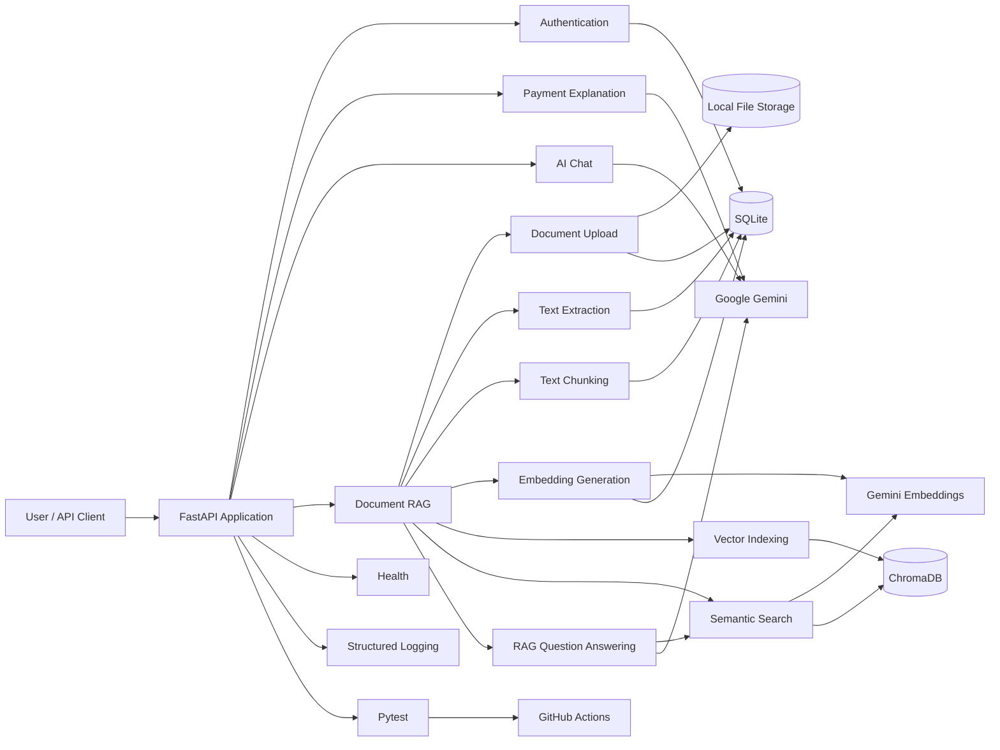
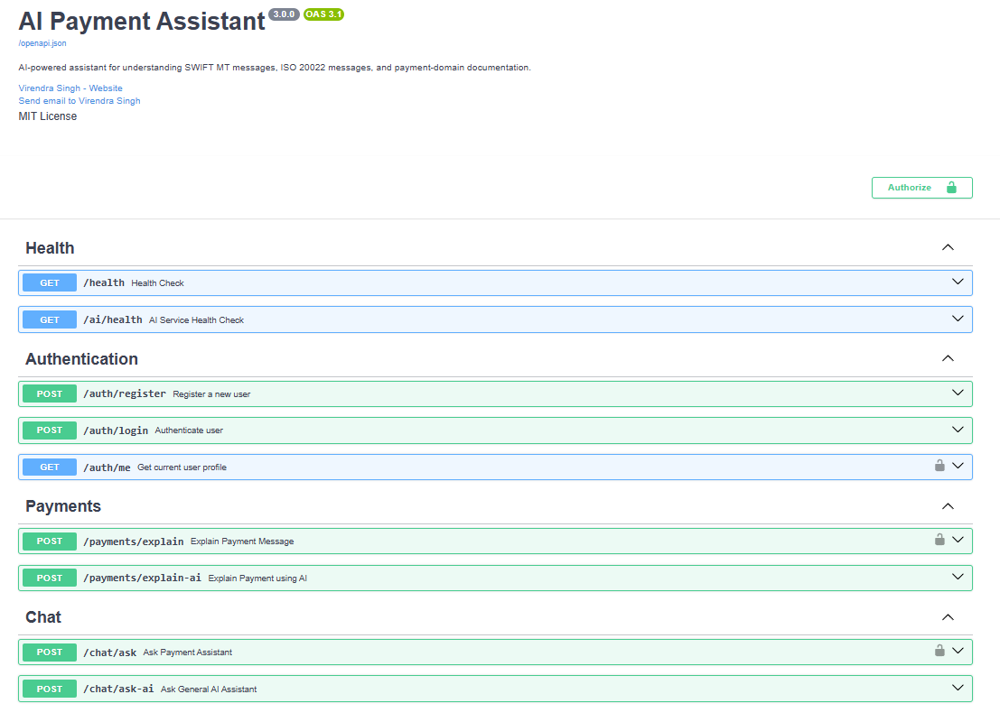
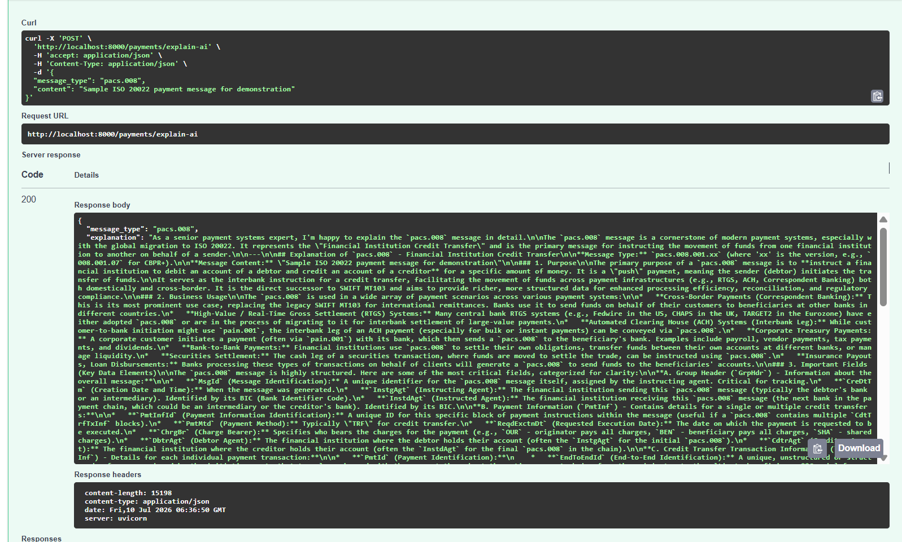

<p align="center">
  
</p>
<h1 align="center">AI Payment Assistant</h1>

<p align="center">
  <strong>AI-powered assistant for understanding SWIFT MT messages, ISO 20022 messages, payment workflows, and payment-domain documentation.</strong>
</p>

<p align="center">
  
  
  
  
  
  
  
  
  
  
</p>

---
## Overview

AI Payment Assistant is a FastAPI-based backend application designed to make complex international-payment concepts and payment documentation easier to understand using Generative AI and Retrieval-Augmented Generation (RAG).

The application can:

- Explain SWIFT MT and ISO 20022 payment messages
- Answer payment-domain questions using Google Gemini
- Register and authenticate users securely with JWT
- Upload and manage payment-related PDF, TXT, and DOCX documents
- Extract text from uploaded documents
- Split document content into searchable chunks
- Generate vector embeddings using Google Gemini
- Store and index document vectors in ChromaDB
- Perform semantic search to retrieve relevant document content
- Answer document-specific questions using a complete RAG pipeline
- Provide source chunks for traceability of AI-generated answers
- Secure document access using user-level ownership
- Delete documents along with physical files, metadata, chunks, and vectors
- Manage database schema changes using Alembic migrations
- Provide application and AI-service health checks
- Run automated tests through Pytest and GitHub Actions

This project combines **backend engineering, Generative AI, Retrieval-Augmented Generation, vector search, and international-payments domain knowledge** to demonstrate how AI can be integrated into a real-world payment-domain application.

---

## Features

### Authentication

- User registration
- Secure user login
- JWT access-token generation
- Protected user-profile endpoint
- Authentication for protected APIs
- User-level document ownership and access control

### Payment Explanation

- Explain payment messages using structured domain logic
- Generate AI-powered payment explanations using Google Gemini
- Support SWIFT MT and ISO 20022 payment-message concepts
- Provide simplified explanations of complex payment fields and workflows
- Maintain separate local and AI-powered explanation endpoints

### AI Chat

- Ask payment-domain and general AI questions
- Generate conversational responses using Google Gemini
- Support payment concepts, terminology, and workflow-related queries
- Provide a standalone AI chat experience independent of uploaded documents

### Document Management

- Upload payment-domain PDF, TXT, and DOCX documents securely
- Associate uploaded documents with the authenticated user
- Store original uploaded files on disk
- Persist document metadata and processing status in SQLite
- List documents belonging to the authenticated user
- Track original filename, content type, file size, and upload timestamp
- Enforce user-level document ownership and access control
- Delete documents together with physical files, metadata, chunks, and ChromaDB vectors

### Document Processing & RAG

- Extract text from uploaded documents
- Split extracted content into configurable overlapping chunks
- Generate numerical embeddings using Google Gemini
- Store and index document vectors in ChromaDB
- Perform semantic search across document chunks
- Retrieve Top-K relevant chunks using vector similarity
- Generate document-grounded answers using Retrieval-Augmented Generation (RAG)
- Return source chunks for answer traceability

### Engineering and Operations

- Environment-based configuration and secret management
- Structured application and request logging
- SQLAlchemy ORM with SQLite persistence
- Alembic-based database schema migrations
- Persistent ChromaDB vector storage
- Modular service architecture for AI, embeddings, RAG, and vector operations
- Pytest unit and API integration testing
- Mocked Gemini and ChromaDB dependencies for deterministic tests
- GitHub Actions continuous integration
- Swagger/OpenAPI documentation
- Application and AI-service health endpoints

---

## Technology Stack

| Area | Technology |
| --- | --- |
| Programming language | Python |
| API framework | FastAPI |
| AI / LLM provider | Google Gemini |
| Embedding provider | Google Gemini Embeddings |
| RAG architecture | Retrieval-Augmented Generation (RAG) |
| Vector database | ChromaDB |
| Database ORM | SQLAlchemy |
| Application database | SQLite |
| Database migrations | Alembic |
| Authentication | JWT |
| Data validation | Pydantic |
| Document processing | PDF / TXT / DOCX processing |
| Semantic search | Vector similarity search |
| Testing | Pytest / FastAPI TestClient |
| CI/CD | GitHub Actions |
| API documentation | Swagger UI / OpenAPI |
| Logging | Python structured logging |

---
## Architecture




### Request Flow

1. A user registers or logs in and receives a JWT access token.
2. The user authorizes protected API requests using the token.
3. FastAPI validates incoming requests using Pydantic models.
4. The application verifies authentication and document ownership where required.
5. The appropriate service processes the request.
6. For document ingestion:
   - The document is uploaded and stored locally.
   - Document metadata is persisted in SQLite.
   - Text is extracted from the document.
   - Extracted text is split into overlapping chunks.
   - Google Gemini generates numerical embeddings for each chunk.
   - Embeddings, chunk content, and metadata are indexed in ChromaDB.
7. For semantic search:
   - The user's question is converted into an embedding.
   - ChromaDB performs vector similarity search.
   - The Top-K most relevant document chunks are retrieved.
8. For RAG question answering:
   - The retrieved chunks are assembled as document context.
   - The question and context are sent to Google Gemini.
   - Gemini generates an answer grounded in the retrieved document content.
   - Relevant source chunks are returned with the answer for traceability.
9. Payment-explanation and general AI-chat endpoints call Google Gemini independently of the document RAG pipeline.
10. The API returns a structured JSON response.
11. Important requests, processing events, errors, and execution times are recorded through structured application logging.
---

## API Documentation

After starting the application, open:

```text
http://127.0.0.1:8000/docs
```

Alternative OpenAPI documentation:

```text
http://127.0.0.1:8000/redoc
```
---

## Screenshots

### Swagger API Overview

Overview of the AI Payment Assistant V3 REST APIs.



### Document Processing Pipeline

Document upload, text extraction, chunking, embedding generation, and vector indexing APIs.


### Semantic Search & RAG APIs

Semantic search and document-grounded question-answering endpoints.


### User Authentication

JWT-based user login and authentication.


### AI-Powered Payment Explanation

Google Gemini-powered explanation of payment messages and payment-domain concepts.



### Document Upload

Authenticated upload of PDF, TXT, and DOCX payment-domain documents.


### GitHub Actions CI

Automated test execution and continuous integration validating the V3 development pipeline.


> **Security Note:** All screenshots should use test or synthetic data. Remove or mask passwords, API keys, JWT tokens, email addresses, personal information, and real or confidential payment data before publishing.

---
## Project Structure

```text
ai-payment-assistant/
│
├── app/
│   │
│   ├── ai/
│   │   ├── embedding_service.py
│   │   └── rag_service.py
│   │
│   ├── documents/
│   │   ├── config.py
│   │   ├── models.py
│   │   ├── router.py
│   │   ├── schemas.py
│   │   └── service.py
│   │
│   ├── services/
│   │   └── gemini_service.py
│   │
│   ├── vector_store/
│   │   └── chroma_store.py
│   │
│   ├── auth.py
│   ├── config.py
│   ├── database.py
│   ├── logger.py
│   ├── main.py
│   ├── models.py
│   ├── payment_service.py
│   └── schemas.py
│
├── migration/
│   ├── versions/
│   │   └── ...
│   ├── env.py
│   ├── README
│   └── script.py.mako
│
├── data/
│   └── chroma/
│
├── docs/
│   └── images/
│       ├── swagger-api-overview.png
│       ├── swagger-document-processing.png
│       ├── swagger-rag.png
│       ├── user-login.png
│       ├── payment-explanation-ai.png
│       ├── document-upload.png
│       └── github-actions.png
│
├── logs/
│
├── tests/
│   ├── conftest.py
│   ├── test_auth.py
│   ├── test_chat.py
│   ├── test_document_ask.py
│   ├── test_document_chunking.py
│   ├── test_document_embeddings.py
│   ├── test_document_extraction.py
│   ├── test_document_search.py
│   ├── test_document_upload.py
│   ├── test_document_vectors.py
│   ├── test_gemini_service.py
│   ├── test_health.py
│   ├── test_login.py
│   └── test_payment.py
│
├── uploads/
│   └── documents/
│
├── .github/
│   └── workflows/
│       └── ci.yml
│
├── alembic.ini
├── .env.example
├── .gitignore
├── requirements.txt
└── README.md
```

---

## Installation

### 1. Clone the repository

```bash
git clone https://github.com/YOUR-USERNAME/ai-payment-assistant.git
cd ai-payment-assistant
```

### 2. Create a virtual environment

#### Windows PowerShell

```powershell
python -m venv .venv
.\.venv\Scripts\Activate.ps1
```

#### macOS or Linux

```bash
python3 -m venv .venv
source .venv/bin/activate
```

### 3. Install dependencies

```bash
pip install --upgrade pip
pip install -r requirements.txt
```

### 4. Create the environment file

Copy the example file:

#### Windows PowerShell

```powershell
Copy-Item .env.example .env
```

#### macOS or Linux

```bash
cp .env.example .env
```

Update `.env` with your local configuration:

```env

# Authentication
SECRET_KEY=replace_with_a_strong_secret_key
ALGORITHM=HS256
ACCESS_TOKEN_EXPIRE_MINUTES=60

# Database
DATABASE_URL=sqlite:///./payment_assistant.db

# Google Gemini
GEMINI_API_KEY=replace_with_your_gemini_api_key
GEMINI_MODEL=gemini-2.5-flash

# Embeddings
GEMINI_EMBEDDING_MODEL=replace_with_your_embedding_model
EMBEDDING_DIMENSION=768

# ChromaDB
CHROMA_PERSIST_DIRECTORY=./data/chroma
CHROMA_COLLECTION_NAME=payment_document_chunks
```

Never commit your real `.env` file.


### 5. Apply database migrations

Version 3 uses Alembic for database schema management.

```bash
alembic upgrade head
```

### 6. Start the application

```bash
uvicorn app.main:app --reload
```

The application will be available at:

```text
http://127.0.0.1:8000
```

### 7. Open Swagger UI

```text
http://127.0.0.1:8000/docs
```

---

## Testing

Run all tests from the project virtual environment:

### Windows PowerShell

```powershell
.\.venv\Scripts\python.exe -m pytest
```

### macOS or Linux
## Testing

The project includes automated tests for the core application, document-processing pipeline, vector search, and RAG functionality.

### Run All Tests

After activating the project virtual environment, run:

```bash
python -m pytest
```

### Run Tests with Detailed Output

```bash
python -m pytest -v
```

### Windows PowerShell

You can also run the tests directly using the virtual environment Python executable:

```powershell
.\.venv\Scripts\python.exe -m pytest
```

For detailed output:

```powershell
.\.venv\Scripts\python.exe -m pytest -v
```

### Run Tests with Coverage

When `pytest-cov` is installed:

```bash
python -m pytest --cov=app --cov-report=term-missing
```

### V3 Test Coverage

The Version 3 test suite covers:

- Authentication and authorization
- User login and JWT handling
- Payment explanation APIs
- AI chat
- Document upload
- Text extraction
- Document chunking
- Embedding generation
- ChromaDB vector indexing
- Semantic search
- RAG-based document question answering
- User-level document access control
- Health and AI-service health endpoints

External services such as Google Gemini are mocked or isolated where appropriate during automated testing. This keeps the test suite deterministic and avoids dependency on live AI API calls or production API quota.

GitHub Actions automatically runs the test suite for configured pushes and pull requests.

---

## Main API Endpoints

| Method | Endpoint | Description | Authentication |
|---|---|---|---|
| GET | `/health` | Application health check | No |
| GET | `/ai/health` | Gemini AI-service health check | No |
| POST | `/auth/register` | Register a new user | No |
| POST | `/auth/login` | Authenticate user with OAuth2 password form data | No |
| GET | `/auth/me` | Get current user profile | Yes |
| POST | `/payments/explain` | Explain a payment message using structured logic | Yes |
| POST | `/payments/explain-ai` | Explain a payment message using Google Gemini | No |
| POST | `/chat/ask` | Ask payment-domain questions | Yes |
| POST | `/chat/ask-ai` | Ask general AI questions | No |
| POST | `/documents/upload` | Upload a PDF, TXT, or DOCX document, persist metadata, and save the physical file | Yes |
| GET | `/documents` | List documents belonging to the authenticated user | Yes |
| DELETE | `/documents/{document_id}` | Delete the physical file, SQLite metadata, document chunks, and ChromaDB vectors | Yes |
| POST | `/documents/{document_id}/process` | Extract text from an uploaded document | Yes |
| GET | `/documents/{document_id}/text` | Retrieve extracted document text | Yes |
| POST | `/documents/{document_id}/chunks` | Split extracted text into overlapping chunks | Yes |
| GET | `/documents/{document_id}/chunks` | Retrieve document chunks | Yes |
| POST | `/documents/{document_id}/embeddings` | Generate numerical embeddings for document chunks | Yes |
| GET | `/documents/{document_id}/embeddings` | Get document embedding status | Yes |
| POST | `/documents/{document_id}/vectors` | Store and index document vectors in ChromaDB | Yes |
| GET | `/documents/{document_id}/vectors` | Get vector-indexing status | Yes |
| POST | `/documents/{document_id}/search` | Perform semantic search and retrieve the Top-K relevant chunks | Yes |
| POST | `/documents/{document_id}/ask` | Ask a document-specific question using the RAG pipeline | Yes |

---

## Example Usage

### Register a user

```bash
curl -X POST "http://127.0.0.1:8000/auth/register" \
  -H "Content-Type: application/json" \
  -d '{
    "name": "Example User",
    "email": "user@example.com",
    "password": "StrongPassword123"
  }'
```

### Log in

```bash
curl -X POST "http://127.0.0.1:8000/auth/login" \
  -H "Content-Type: application/x-www-form-urlencoded" \
  -d "username=user@example.com&password=StrongPassword123"
```

The login endpoint follows FastAPI's OAuth2 password flow. Use `username` for the registered email address.

### Explain a payment message

```bash
TOKEN="paste_access_token_here"

curl -X POST "http://127.0.0.1:8000/payments/explain" \
  -H "Authorization: Bearer $TOKEN" \
  -H "Content-Type: application/json" \
  -d '{
    "message_type": "pacs.008",
    "content": "Add a safe sample payment message here"
  }'
```

Use `/payments/explain-ai` for the AI-powered public endpoint.

### Upload a document

The primary upload endpoint is `/documents/upload`. It accepts authenticated multipart uploads, allows only PDF and TXT files, enforces a 10 MB limit, stores the file under `uploads/documents`, and creates a document record in the database.

```bash
curl -X POST "http://127.0.0.1:8000/documents/upload" \
  -H "Authorization: Bearer $TOKEN" \
  -F "file=@sample-document.pdf;type=application/pdf"
```

Expected response fields:

- `document_id`
- `original_filename`
- `content_type`
- `file_size`
- `processing_status`
- `uploaded_at`

The older `/documents/upload/v2` endpoint still exists for direct local file storage and also accepts `.docx` files.

---

## Security

- Passwords should be stored only as secure hashes.
- Protected endpoints require JWT authentication.
- Secrets are loaded from environment variables.
- `.env` must remain excluded through `.gitignore`.
- Screenshots and examples must not contain real customer or payment data.
- API responses should avoid exposing internal exception details.
- Uploaded documents should be validated for file type and size.
- `/documents/upload` accepts only PDF and TXT files and enforces a 10 MB size limit.

---

## Continuous Integration

GitHub Actions runs the automated test suite when code is pushed or a pull request is created.

Suggested workflow checks:

- Install Python
- Install project dependencies
- Run Pytest
- Fail the workflow when tests fail

Workflow file location:

```text
.github/workflows/tests.yml
```

---

## Current Version

### Version 3.0.0

Version 3 includes:

- JWT-based authentication and protected APIs
- Structured payment-message explanation
- AI-powered payment explanation using Google Gemini
- Payment-domain and general AI chat endpoints
- Authenticated PDF, TXT, and DOCX document upload
- Database-backed document metadata and user ownership
- Text extraction from uploaded documents
- Configurable document chunking
- Gemini-based embedding generation
- ChromaDB vector storage and indexing
- Semantic search across document chunks
- Retrieval-Augmented Generation (RAG) for document-specific Q&A
- Source chunk references for answer traceability
- User-scoped document retrieval and access control
- Complete document deletion across file storage, SQLite, chunks, and ChromaDB
- Alembic-based database schema migrations
- Structured application and request logging
- Automated Pytest coverage for the V3 document pipeline
- GitHub Actions CI
- Improved Swagger/OpenAPI documentation

---

## Roadmap

### Planned Version 4 Improvements

- Payment-message validation for SWIFT and ISO 20022 messages
- Cross-document semantic search across multiple uploaded documents
- Conversation history and contextual follow-up questions
- Enhanced RAG with metadata filtering and retrieval improvements
- Role-based access control (RBAC)
- PostgreSQL support for production-grade persistence
- Docker and Docker Compose deployment
- Cloud deployment
- Improved monitoring, metrics, and analytics
- Web-based frontend for document upload, search, and AI interaction
- Improved source citations and document traceability
- Production-ready security and configuration management

---

## Learning Outcomes

This project demonstrates practical experience in:

- FastAPI backend application development
- REST API design and OpenAPI documentation
- JWT-based authentication and API security
- User-level authorization and resource ownership
- SQLAlchemy ORM and SQLite database integration
- Alembic-based database schema migrations
- Google Gemini and Generative AI integration
- Prompt design for payment-domain AI applications
- Document ingestion and text extraction
- Text chunking strategies for AI applications
- Vector embedding generation
- ChromaDB vector database integration
- Vector indexing and similarity search
- Semantic search over document content
- Retrieval-Augmented Generation (RAG)
- Context-grounded document question answering
- Source-aware AI responses and traceability
- SWIFT and ISO 20022 payment-domain application design
- Separation of application metadata and vector storage
- Modular service-oriented backend architecture
- Pytest-based unit and API testing
- Mocking external AI dependencies for deterministic tests
- GitHub Actions continuous integration
- Structured logging and error handling
- Environment-based configuration and secret management
- Technical architecture and API documentation

---

## Author

**Virendra Singh**

- GitHub: `https://github.com/YOUR-USERNAME`
- LinkedIn: `https://www.linkedin.com/in/YOUR-LINKEDIN-PROFILE`

---

## License

This project is licensed under the MIT License. See the `LICENSE` file for details.

---

## Disclaimer

This project is intended for learning and demonstration purposes. It must not be used to process real customer data, confidential payment messages, or production financial transactions without appropriate security, compliance, validation, and operational controls.
