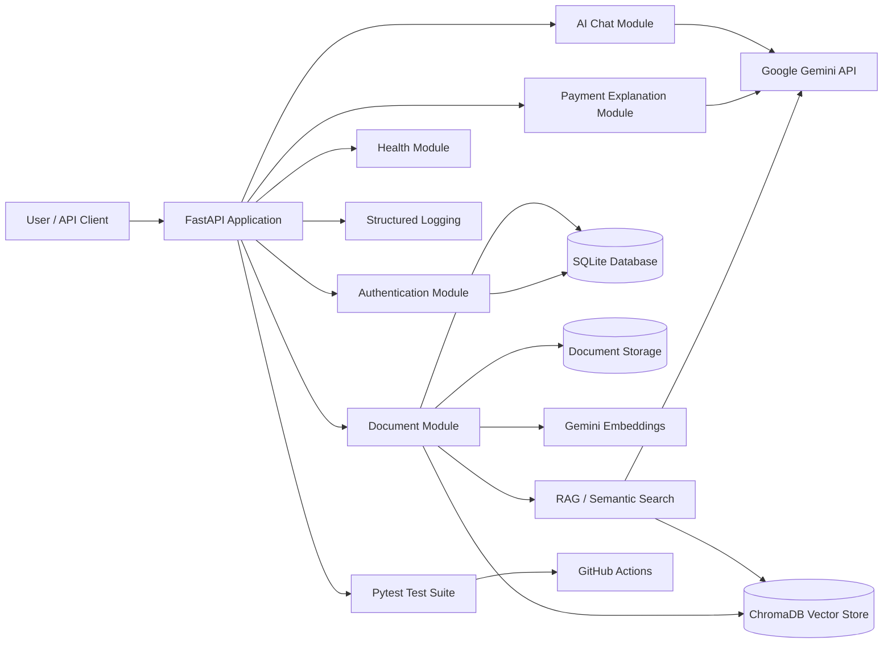

# AI Payment Assistant

<p align="center">
  <strong>AI-powered assistant for understanding SWIFT MT messages, ISO 20022 messages, payment workflows, and payment-domain documentation.</strong>
</p>

<p align="center">
  
  
  
  
  
</p>

---

## Overview

AI Payment Assistant is a FastAPI-based backend application designed to make complex international-payment concepts easier to understand.

The application can:

- Explain SWIFT MT and ISO 20022 payment messages
- Answer payment-domain questions using AI
- Register and authenticate users with JWT
- Upload and manage payment-related documents
- Provide application and AI-service health checks
- Run automated tests through GitHub Actions

This project combines backend engineering, Generative AI, and international-payments domain knowledge.

---

## Features

### Authentication

- User registration
- User login
- JWT access-token generation
- Protected user-profile endpoint

### Payment Explanation

- Explain payment messages using structured logic
- Generate AI-powered payment explanations
- Support SWIFT MT and ISO 20022 concepts

### AI Chat

- Ask payment-domain questions
- Ask general AI questions
- Integrate with Google Gemini

### Document Intelligence & RAG

- Upload PDF, TXT, and DOCX payment-domain documents
- Extract and retrieve document text
- Split extracted text into configurable chunks
- Generate Gemini embeddings for document chunks
- Index vectors in persistent ChromaDB
- Perform semantic search over user-owned documents
- Ask document-grounded questions using Retrieval-Augmented Generation (RAG)
- Return source chunks with generated answers
- Delete the physical file, SQLite metadata/chunks, and Chroma vectors together
- Protect all document APIs using JWT authentication and user ownership

### Engineering and Operations

- Environment-based configuration
- Structured application logging
- SQLAlchemy database integration
- Pytest unit and API testing
- GitHub Actions continuous integration
- Health and AI-service health endpoints

---

## Technology Stack

| Area | Technology |
|---|---|
| Programming language | Python |
| API framework | FastAPI |
| AI provider | Google Gemini |
| Database ORM | SQLAlchemy |
| Database | SQLite |
| Database migrations | Alembic |
| Vector database | ChromaDB |
| Embeddings | Google Gemini Embeddings |
| Authentication | JWT |
| Validation | Pydantic |
| Testing | Pytest |
| CI/CD | GitHub Actions |
| API documentation | Swagger UI / OpenAPI |

---

## Architecture



### Request Flow

1. A user registers or logs in and receives a JWT access token.
2. The user uploads a PDF, TXT, or DOCX payment document.
3. The document is stored physically and its metadata is stored in SQLite against the authenticated user.
4. Text is extracted from the uploaded document.
5. Extracted text is split into ordered chunks.
6. Gemini generates numerical embeddings for the chunks.
7. Chunk vectors, text, and metadata are indexed in ChromaDB.
8. For semantic search, the question is embedded and compared with indexed vectors to retrieve the most relevant chunks.
9. For `/documents/{document_id}/ask`, the retrieved chunks are supplied to Gemini as grounded context and the API returns an answer with source chunks.
10. Important events and errors are recorded through application logging.

---

## API Documentation

After starting the application, open:

```text
http://127.0.0.1:8000/docs
```

Alternative OpenAPI documentation:

```text
http://127.0.0.1:8000/redoc
```

---

## Screenshots

### Swagger API Overview


### User Login


### AI Payment Explanation


### Document Upload


### GitHub Actions


> Add the corresponding image files under `docs/images/`. Remove any passwords, API keys, JWT tokens, personal data, or real payment information before publishing screenshots.

---

## Project Structure

```text
ai-payment-assistant/
├── app/
│   ├── routers/
│   │   ├── auth.py
│   │   ├── chat.py
│   │   ├── documents.py
│   │   ├── health.py
│   │   └── payments.py
│   ├── services/
│   ├── models/
│   ├── schemas/
│   ├── config.py
│   ├── database.py
│   └── main.py
├── tests/
├── docs/
│   └── images/
├── .github/
│   └── workflows/
├── .env.example
├── .gitignore
├── requirements.txt
├── README.md
└── LICENSE
```

Adjust this structure so it matches the actual folders and filenames in your repository.

---

## Installation

### 1. Clone the repository

```bash
git clone https://github.com/YOUR-USERNAME/ai-payment-assistant.git
cd ai-payment-assistant
```

### 2. Create a virtual environment

#### Windows PowerShell

```powershell
python -m venv .venv
.\.venv\Scripts\Activate.ps1
```

#### macOS or Linux

```bash
python3 -m venv .venv
source .venv/bin/activate
```

### 3. Install dependencies

```bash
pip install --upgrade pip
pip install -r requirements.txt
```

### 4. Create the environment file

Copy the example file:

#### Windows PowerShell

```powershell
Copy-Item .env.example .env
```

#### macOS or Linux

```bash
cp .env.example .env
```

Update `.env` with your local configuration:

```env
SECRET_KEY=replace_with_a_strong_secret_key
ALGORITHM=HS256
ACCESS_TOKEN_EXPIRE_MINUTES=60
DATABASE_URL=sqlite:///./ai_payment_assistant.db
GEMINI_API_KEY=replace_with_your_gemini_api_key
```

Never commit your real `.env` file.

### 5. Start the application

```bash
uvicorn app.main:app --reload
```

The application will be available at:

```text
http://127.0.0.1:8000
```

### 6. Open Swagger UI

```text
http://127.0.0.1:8000/docs
```

---

## Testing

Run all tests:

```bash
pytest
```

Run tests with detailed output:

```bash
pytest -v
```

Run tests with coverage when `pytest-cov` is installed:

```bash
pytest --cov=app --cov-report=term-missing
```

---

## Main API Endpoints

| Method | Endpoint | Description | Authentication |
|---|---|---|---|
| GET | `/health` | Application health check | No |
| GET | `/ai/health` | AI-service health check | No |
| POST | `/auth/register` | Register a new user | No |
| POST | `/auth/login` | Authenticate user | No |
| GET | `/auth/me` | Get current user profile | Yes |
| POST | `/payments/explain` | Explain payment message | Yes |
| POST | `/payments/explain-ai` | Explain payment using AI | No/Yes* |
| POST | `/chat/ask` | Ask Payment Assistant | Yes |
| POST | `/chat/ask-ai` | Ask General AI Assistant | No/Yes* |
| POST | `/documents/upload` | Upload PDF/TXT/DOCX document | Yes |
| GET | `/documents` | List current user's documents | Yes |
| POST | `/documents/{document_id}/process` | Extract document text | Yes |
| GET | `/documents/{document_id}/text` | Get extracted text | Yes |
| POST | `/documents/{document_id}/chunks` | Split document text into chunks | Yes |
| GET | `/documents/{document_id}/chunks` | Get document chunks | Yes |
| POST | `/documents/{document_id}/embeddings` | Generate chunk embeddings | Yes |
| GET | `/documents/{document_id}/embeddings` | Get embedding status | Yes |
| POST | `/documents/{document_id}/vectors` | Index vectors in ChromaDB | Yes |
| GET | `/documents/{document_id}/vectors` | Get vector-storage status | Yes |
| POST | `/documents/{document_id}/search` | Semantic search over document chunks | Yes |
| POST | `/documents/{document_id}/ask` | Ask a grounded RAG question | Yes |
| DELETE | `/documents/{document_id}` | Delete file, metadata, chunks and vectors | Yes |

\* Update the authentication status to match your current implementation.

---

## Example Usage

### Register a user

```bash
curl -X POST "http://127.0.0.1:8000/auth/register" \
  -H "Content-Type: application/json" \
  -d '{
    "name": "Example User",
    "email": "user@example.com",
    "password": "StrongPassword123"
  }'
```

### Log in

```bash
curl -X POST "http://127.0.0.1:8000/auth/login" \
  -H "Content-Type: application/json" \
  -d '{
    "email": "user@example.com",
    "password": "StrongPassword123"
  }'
```

### Explain a payment message

```bash
curl -X POST "http://127.0.0.1:8000/payments/explain-ai" \
  -H "Content-Type: application/json" \
  -d '{
    "message_type": "pacs.008",
    "content": "Add a safe sample payment message here"
  }'
```

---

## Security

- Passwords should be stored only as secure hashes.
- Protected endpoints require JWT authentication.
- Secrets are loaded from environment variables.
- `.env` must remain excluded through `.gitignore`.
- Screenshots and examples must not contain real customer or payment data.
- API responses should avoid exposing internal exception details.
- Uploaded documents should be validated for file type and size.

---

## Continuous Integration

GitHub Actions runs the automated test suite when code is pushed or a pull request is created.

Suggested workflow checks:

- Install Python
- Install project dependencies
- Run Pytest
- Fail the workflow when tests fail

Workflow file location:

```text
.github/workflows/tests.yml
```

---

## Current Version

### Version 3.0.0

Version 3 includes:

- Everything delivered in Version 2
- PDF, TXT, and DOCX document processing
- Extracted-text persistence and retrieval
- Configurable text chunking
- Google Gemini embedding generation
- ChromaDB persistent vector storage
- User-scoped semantic search
- Retrieval-Augmented Generation (RAG) through `/documents/{document_id}/ask`
- Source chunk traceability in RAG responses
- Alembic database migrations
- Full document deletion across physical storage, SQLite, chunks, and Chroma vectors
- Automated tests for upload, extraction, chunking, embeddings, vector indexing, semantic search, and RAG

### V3 Document Ingestion Flow

```text
Upload Document
      ↓
Extract Text
      ↓
Chunk Text
      ↓
Generate Embeddings
      ↓
Store / Index Vectors in ChromaDB
```

### V3 Retrieval & RAG Flow

```text
User Question
      ↓
Generate Query Embedding
      ↓
Semantic Search in ChromaDB
      ↓
Retrieve Top-K Relevant Chunks
      ↓
Build Grounded Context
      ↓
Gemini LLM
      ↓
Answer + Source Chunks
```

---

## Roadmap

Planned Version 4 improvements:

- Multi-document RAG
- Conversation history and follow-up document questions
- Hybrid keyword + vector retrieval
- Reranking and retrieval-quality evaluation
- Page-level/source citations
- Background document processing
- Role-based access control
- PostgreSQL / pgvector evaluation
- Docker and cloud deployment
- Improved monitoring and analytics
- Web-based frontend

---

## Learning Outcomes

This project demonstrates practical experience in:

- FastAPI backend development
- REST API design
- JWT-based authentication
- SQLAlchemy database integration
- Generative AI integration
- Embedding generation and vector databases
- Semantic search and Retrieval-Augmented Generation (RAG)
- ChromaDB integration
- Alembic database migrations
- User-scoped document retrieval
- Payment-domain application design
- Automated testing
- Continuous integration
- Logging and configuration management
- Technical documentation

---

## Author

**Virendra Singh**

- GitHub: `https://github.com/YOUR-USERNAME`
- LinkedIn: `https://www.linkedin.com/in/YOUR-LINKEDIN-PROFILE`

---

## License

This project is licensed under the MIT License. See the `LICENSE` file for details.

---

## Disclaimer

This project is intended for learning and demonstration purposes. It must not be used to process real customer data, confidential payment messages, or production financial transactions without appropriate security, compliance, validation, and operational controls.
